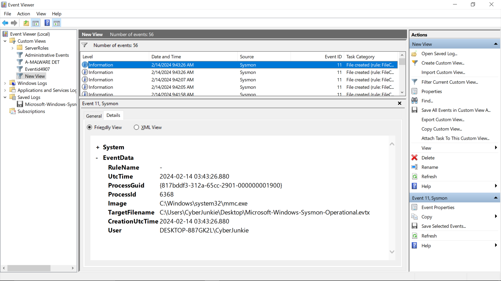
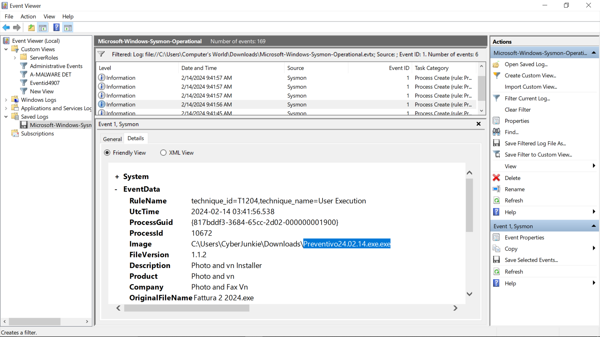
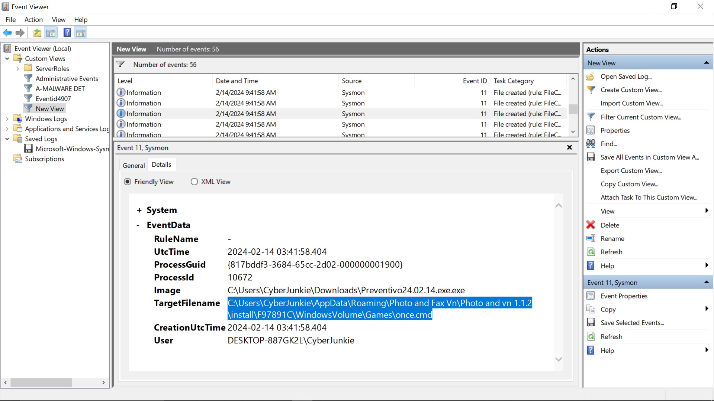
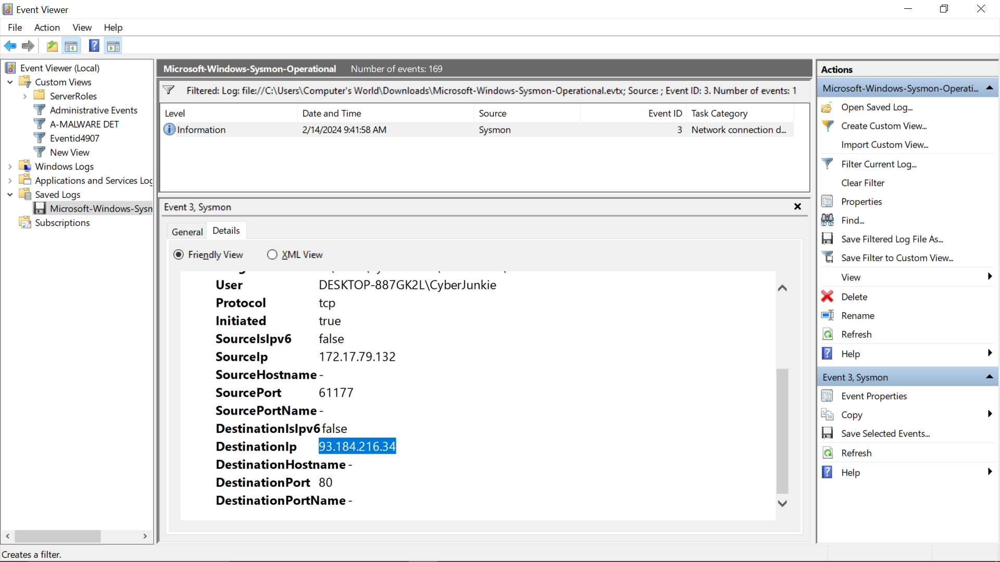
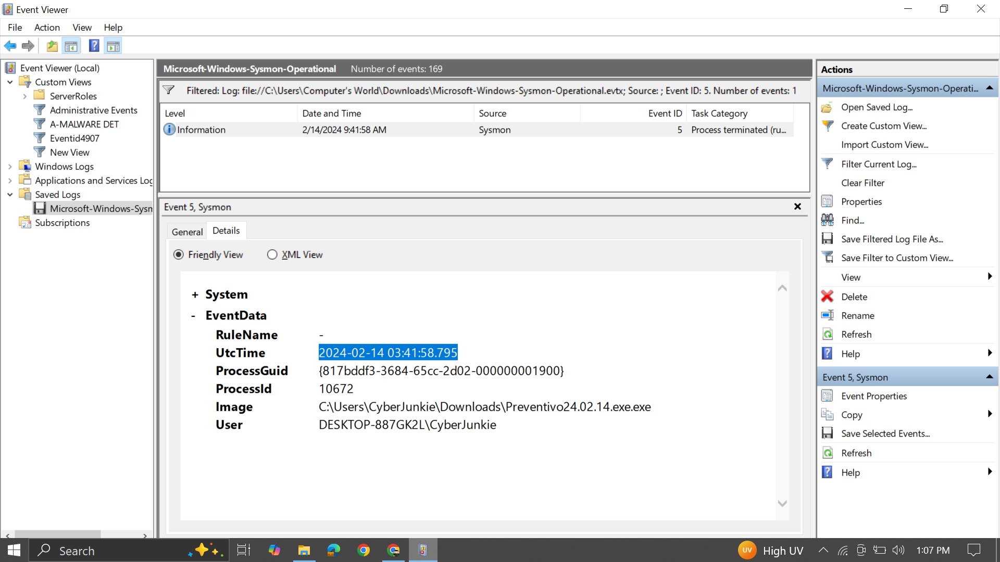

# Unit42 Writeup

## Overview

**Machine/Lab:** Unit42  
**Platform:** Hack The Box Academy  
**Category:** Digital Forensics / Incident Response  
**Difficulty:** Easy  
**Tools Used:** Windows Event Viewer, Sysmon (System Monitor)  
**Log File:** `Microsoft-Windows-Sysmon-Operational.evtx`

---

## Scenario

So here's the setup — we're handed a Sysmon operational log file and told to figure out what happened on a machine called `DESKTOP-887GK2L`, used by someone going by `CyberJunkie`. The goal is to dig through the events, piece together the attack, and answer the forensic questions.

---

## Environment

| Field | Value |
|---|---|
| Hostname | DESKTOP-887GK2L |
| User | CyberJunkie |
| Log Source | Microsoft-Windows-Sysmon-Operational |
| Total Events | 169 |
| Date of Incident | 2024-02-14 |

---

## Investigation & Findings

### Task 1 — How many Event logs are there with Event ID 11?

**What's going on here:**  
You can filter out the number of events by applying Event ID 11 filter and the total number of events can be shown at the top.

---

### Task 2 — What is the malicious process that infected the victim's system?

**What's going on here:**  
We will filter out logs by applying Event ID 1 and we will look for the suspicious service execution and can confirm the malicious activity by verifying it through Virustotal.

---
### Task 3 — Which Cloud drive was used to distribute the malware?
**What's going on here:**  
You can fid the cloud drive that distribute the malware by looking and Event ID 22 and you can verify it through Virustotal.The cloud drive that was used to distribute the malware was

`dropbox`

---

### Task 4 —  What was the timestamp changed to for the PDF file?
**What's going on here:**  
To look for the time stomping you can check event id 2 by looking at this event id you can go through the events and will locate the required flag.

`2024-01-14 08:10:06`

---
### Task 5 — 

**What's going on here:**  
Just about 2 seconds after execution, the malware quietly dropped a script called `once.cmd` into a deeply buried folder inside `AppData\Roaming`. The folder path is designed to look boring and legitimate — hiding under a fake "Games" directory. `AppData\Roaming` is a go-to spot for malware because it's writable without admin rights and often ignored by users. This `.cmd` file is almost certainly the next stage of the attack — a script waiting to do more damage.

> **Notable Path:** `C:\Users\CyberJunkie\AppData\Roaming\Photo and Fax Vn\Photo and vn 1.1.2 install\F97891C\WindowsVolume\Games\once.cmd`

---

### Task 6 —  What domain name did it try to connect to?

**What's going on here:**  
You can check for the domain name filtering event id 22. To get the domain name we will look for the process name with malicious file name.the domain name was

`www.example.com`

---

### Task 7 — Which IP address did the malicious process try to reach out to?

**What's going on here:**  
 The malware reached out to an external IP — `93.184.216.34` on port 80 (plain HTTP, not even encrypted). This is the C2 callback, where the malware checks in with its operator or pulls down additional instructions. The fact that it used port 80 is both brazen and smart — HTTP traffic often blends in with normal web browsing and may not get blocked by firewalls.

---

### Task 8 — When did the process terminate itself?

|

**What's going on here:**  
We will look for the process termination.In event viewer,you can look for the terminated process by applying filter Event ID 5. After applying the filter the terminated process was shown and by looking in the detail you will find the timestamp of the event.

---

## Key Indicators of Compromise (IOCs)

| Type | Value |
|---|---|
| Malicious File | `Preventivo24.02.14.exe.exe` |
| File Path | `C:\Users\CyberJunkie\Downloads\Preventivo24.02.14.exe.exe` |
| Dropped File | `once.cmd` |
| Dropped Path | `C:\Users\CyberJunkie\AppData\Roaming\Photo and Fax Vn\Photo and vn 1.1.2 install\F97891C\WindowsVolume\Games\once.cmd` |
| C2 IP | `93.184.216.34` |
| C2 Port | `80` (HTTP) |

| MITRE Technique | T1204 — User Execution |

---

---

## Lessons Learned

1. **Double extensions are a trap.** A file ending in `.exe.exe` is never innocent — Windows hides known extensions by default, which makes this even more dangerous for everyday users.
2. **AppData\Roaming is prime real estate for malware.** It doesn't need admin rights, and most users never look there. Keep an eye on file creation events in that directory.
3. **Fast droppers are sneaky.** This whole infection chain took under 3 seconds. Correlating Event IDs 1, 11, 3, and 5 together is what exposes it — no single event tells the full story.
4. **Unencrypted C2 on port 80 can fly under the radar.** Just because it looks like web traffic doesn't mean it is. Monitor for unexpected outbound connections from non-browser processes.
5. **Sysmon's MITRE tagging is a gift.** When the `RuleName` field already says `technique_id=T1204`, half your triage work is done for you.

---

*Writeup based on Sysmon log analysis — Hack The Box Academy: Unit42*
